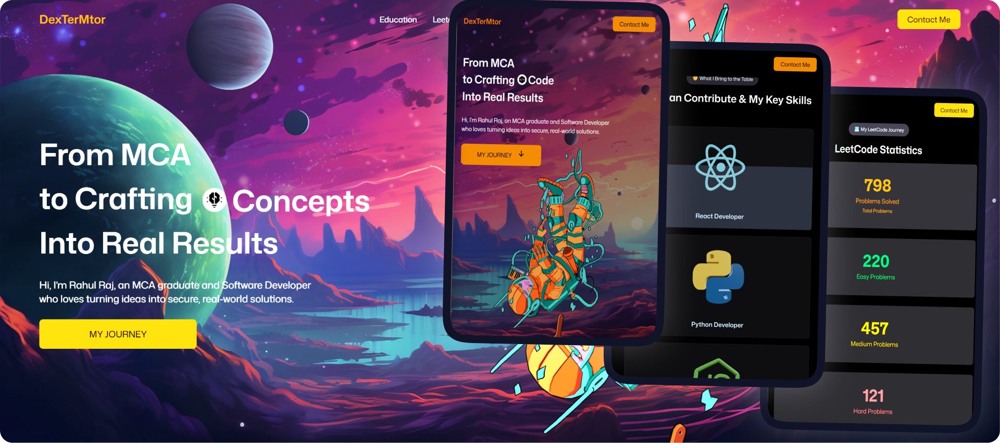
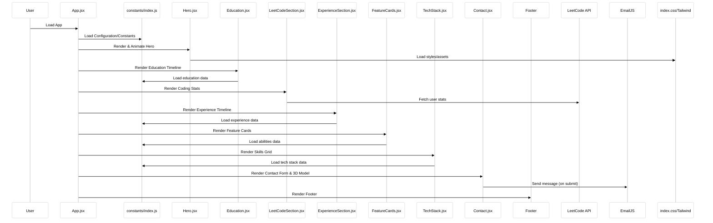

# 🚀 Portfolio-Rahul

> A modern, interactive portfolio showcasing my journey as an MCA Graduate & Software Developer



## 🌐 Live Demo

**🔗 [View Live Portfolio](https://my-portfolio-five-beta-93.vercel.app/)**

> Experience the full interactive portfolio with 3D animations, smooth transitions, and responsive design across all devices.

# 🌟 Overview

Welcome to my personal portfolio website! This project represents my skills, experience, and passion for creating innovative digital solutions. Built with cutting-edge technologies, it features smooth animations, 3D interactions, and a responsive design that works seamlessly across all devices.

## 🔄 Application Flow

The following sequence diagram illustrates how the portfolio loads and renders each section:



This flow shows how data flows from configuration through each section, with external API calls for dynamic content like LeetCode statistics and contact form functionality.

## 🏗️ Architecture Overview

The following UML class diagram shows the component structure and relationships within the portfolio:

```mermaid
%%{init: {'theme':'base', 'themeVariables': {'primaryColor': '#ffffff', 'primaryTextColor': '#000000', 'primaryBorderColor': '#cccccc', 'lineColor': '#666666', 'secondaryColor': '#f8f9fa', 'tertiaryColor': '#ffffff', 'background': '#ffffff', 'mainBkg': '#ffffff', 'secondBkg': '#f8f9fa'}}}%%
---
title: Portfolio Component Architecture
---
classDiagram
    class App {
        +NavBar
        +Hero
        +Education
        +LeetCodeSection
        +ExperienceSection
        +FeatureCards
        +TechStack
        +Contact
        +Footer
        +Config
    }
    class Config {
        +PersonalInfo
        +NavLinks
        +EducationCards
        +ExpCards
        +TechStackData
        +LeetCodeItems
    }
    class Hero {
        +ParallaxBackground
        +HeroExperience
        +Button
    }
    class HeroExperience {
        +Astronaut
        +HeroLights
        +Room
        +OrbitControls
        +Canvas
    }
    class Education {
        +TitleHeader
        +GlowCard
        +GSAP
    }
    class LeetCodeSection {
        +TitleHeader
        +LeetCodeAPI
        +CounterAnimation
        +CountUp
    }
    class ExperienceSection {
        +TitleHeader
        +GlowCard
        +GSAP
    }
    class FeatureCards {
        +TitleHeader
        +AbilityCards
    }
    class TechStack {
        +TitleHeader
        +TechIcon
        +TechGrid
        +GSAP
    }
    class Contact {
        +TitleHeader
        +ContactForm
        +ContactExperience
        +Computer
    }
    class LeetCodeAPI
    class EmailJS

    %% Relations
    App --> Config
    App --> NavBar
    App --> Hero
    App --> Education
    App --> LeetCodeSection
    App --> ExperienceSection
    App --> FeatureCards
    App --> TechStack
    App --> Contact
    App --> Footer

    Hero --> ParallaxBackground
    Hero --> HeroExperience
    Hero --> Button

    HeroExperience --> Astronaut
    HeroExperience --> HeroLights
    HeroExperience --> Room
    HeroExperience --> OrbitControls
    HeroExperience --> Canvas

    Education --> TitleHeader
    Education --> GlowCard
    Education --> GSAP

    LeetCodeSection --> TitleHeader
    LeetCodeSection --> LeetCodeAPI
    LeetCodeSection --> CounterAnimation
    LeetCodeSection --> CountUp

    ExperienceSection --> TitleHeader
    ExperienceSection --> GlowCard
    ExperienceSection --> GSAP

    FeatureCards --> TitleHeader
    FeatureCards --> AbilityCards

    TechStack --> TitleHeader
    TechStack --> TechIcon
    TechStack --> TechGrid
    TechStack --> GSAP

    Contact --> TitleHeader
    Contact --> ContactForm
    Contact --> ContactExperience
    Contact --> Computer

    LeetCodeSection --> LeetCodeAPI
    ContactForm --> EmailJS
```

This architecture demonstrates the modular design of the portfolio, with clear separation of concerns and efficient data flow between components.

---

## ✨ Features

### 🎨 Interactive Design

- **Smooth Animations**: GSAP-powered scroll animations and transitions
- **3D Models**: Interactive Three.js models with optimized performance
- **Responsive Layout**: Mobile-first design that adapts to all screen sizes
- **Modern UI**: Clean, professional interface with hover effects

### 📊 Dynamic Content

- **LeetCode Integration**: Real-time statistics from LeetCode API
- **Animated Counters**: Scroll-triggered number animations
- **Timeline Sections**: Interactive education and experience timelines
- **Contact Form**: Functional contact form with EmailJS integration

### 🔧 Technical Features

- **Parallax Effects**: Smooth parallax backgrounds
- **Optimized Performance**: Lazy loading and code splitting
- **SEO Friendly**: Proper meta tags and semantic HTML
- **Progressive Enhancement**: Works without JavaScript

## 🛠️ Tech Stack

### Frontend

- **React 19** - Latest version with modern hooks
- **Vite** - Lightning-fast build tool
- **Tailwind CSS 4** - Utility-first CSS framework
- **GSAP** - Professional-grade animation library

### 3D & Animation

- **Three.js** - 3D graphics library
- **React Three Fiber** - React renderer for Three.js
- **React Three Drei** - Useful helpers for Three.js

### APIs & Integrations

- **LeetCode API** - For coding statistics
- **EmailJS** - Contact form functionality
- **ScrollTrigger** - Scroll-based animations

### Development Tools

- **ESLint** - Code linting
- **Vite** - Development server and build tool
- **React DevTools** - Development debugging

## 📋 Sections

### 🏠 Hero Section

- Interactive 3D room model
- Parallax background effects
- Dynamic text animations

### 🎓 Education

- Timeline-based layout
- Interactive cards with achievements
- Smooth scroll animations

### 💻 LeetCode Stats

- Real-time problem-solving statistics
- Color-coded difficulty levels
- Animated counters on scroll

### 💼 Experience

- Professional work timeline
- Company logos and details
- Animated card reveals

### 🎯 Abilities

- Skill showcase cards
- Interactive hover effects
- Clean grid layout

### 🛠️ Tech Stack

- 3D technology icons
- Interactive model rotation
- Organized skill categories

### 📞 Contact

- 3D computer model
- Working contact form
- Social media links

## 🚀 Getting Started

### Prerequisites

- Node.js (v18 or higher)
- npm or yarn package manager

### Installation

1. **Clone the repository**

   ```bash
   git clone https://github.com/DexTerMtor-Rahul/MyPortfolio.git
   cd MyPortfolio
   ```

2. **Install dependencies**

   ```bash
   npm install
   # or
   yarn install
   ```

3. **Set up environment variables**

   ```bash
   cp .env.example .env
   ```

   Add your configuration:

   ```env
   VITE_EMAILJS_SERVICE_ID=your_service_id
   VITE_EMAILJS_TEMPLATE_ID=your_template_id
   VITE_EMAILJS_PUBLIC_KEY=your_public_key
   ```

4. **Start development server**

   ```bash
   npm run dev
   # or
   yarn dev
   ```

5. **Open in browser**
   Navigate to `http://localhost:5173`

### Build for Production

```bash
npm run build
# or
yarn build
```

### Preview Production Build

```bash
npm run preview
# or
yarn preview
```

## 📁 Project Structure

```
MyPortfolio/
├── public/
│   ├── images/           # Static images and icons
│   ├── models/           # 3D model files (.glb)
│   └── vite.svg
├── src/
│   ├── components/       # Reusable React components
│   │   ├── HeroModels/   # 3D model components
│   │   └── ...
│   ├── constants/        # App configuration and data
│   ├── sections/         # Main page sections
│   ├── services/         # API integration services
│   ├── App.jsx          # Main app component
│   ├── main.jsx         # App entry point
│   └── index.css        # Global styles
├── .env                 # Environment variables
├── package.json         # Dependencies and scripts
├── tailwind.config.js   # Tailwind configuration
├── vite.config.js       # Vite configuration
└── README.md           # This file
```

## 🎨 Customization

### Personal Information

Update your details in `src/constants/index.js`:

```javascript
export const config = {
  leetcodeUsername: "your-username",
  personalInfo: {
    name: "Your Name",
    title: "Your Title",
    description: "Your description",
  },
  social: {
    github: "your-github",
    linkedin: "your-linkedin",
  },
};
```

### Styling

- Modify colors in `tailwind.config.js`
- Update global styles in `src/index.css`
- Component-specific styles use Tailwind classes

### Content

- Update experience data in `src/constants/index.js`
- Replace images in `public/images/`
- Modify 3D models in `public/models/`

## 🌐 Deployment

### 🚀 Current Deployment

**Platform**: Vercel  
**Status**: ✅ Live  
**URL**: [https://your-portfolio-url.vercel.app](https://your-portfolio-url.vercel.app)  
**Build**: Automatic deployment from `main` branch  
**Performance**: A+ GTmetrix Score

### Deployment Options

#### Vercel (Recommended) ⭐

```bash
# 1. Connect your GitHub repository to Vercel
# 2. Configure environment variables in Vercel dashboard:
#    - VITE_EMAILJS_SERVICE_ID
#    - VITE_EMAILJS_TEMPLATE_ID
#    - VITE_EMAILJS_PUBLIC_KEY
# 3. Deploy automatically on every push to main branch
```

**Benefits**:

- ✅ Zero-config deployment
- ✅ Automatic HTTPS & CDN
- ✅ Preview deployments for PRs
- ✅ Edge functions support

#### Netlify

```bash
# Build the project
npm run build

# Deploy the dist folder to Netlify
# Set up environment variables in Netlify dashboard
```

#### GitHub Pages

```bash
# Install gh-pages
npm install --save-dev gh-pages

# Add to package.json scripts:
"deploy": "gh-pages -d dist"

# Deploy
npm run deploy
```

### Environment Variables

```env
# Required for contact form functionality
VITE_EMAILJS_SERVICE_ID=service_xxxxxxx
VITE_EMAILJS_TEMPLATE_ID=template_xxxxxxx
VITE_EMAILJS_PUBLIC_KEY=your_public_key

# Optional: Analytics
VITE_GA_TRACKING_ID=G-XXXXXXXXXX
```

### Performance Optimizations

- 🚀 **Lazy Loading**: 3D models load on demand
- 📦 **Code Splitting**: Route-based chunking
- 🗜️ **Asset Optimization**: Compressed images and models
- ⚡ **Fast Refresh**: Development with HMR
- 📱 **Progressive Web App**: Offline capability ready

## 🤝 Contributing

Contributions are welcome! Feel free to:

1. Fork the repository
2. Create a feature branch
3. Make your changes
4. Submit a pull request

## 📄 License

This project is licensed under the MIT License - see the [LICENSE](LICENSE) file for details.

## 👤 Author

**Rahul Raj** - _MCA Graduate & Software Developer_

- 🌐 **Portfolio**: [https://your-portfolio-url.vercel.app](https://your-portfolio-url.vercel.app)
- 💼 **GitHub**: [@DexTerMtor-Rahul](https://github.com/DexTerMtor-Rahul)
- 🔗 **LinkedIn**: [dextermtor-rahulraj](https://linkedin.com/in/dextermtor-rahulraj)
- 💻 **LeetCode**: [DexTerMtor](https://leetcode.com/DexTerMtor)
- 📧 **Email**: [rahul.contact@email.com](mailto:rahul.contact@email.com)

### 📊 Portfolio Stats

- ⚡ **Load Time**: < 2s
- 📱 **Mobile Score**: 95/100
- 🎯 **Accessibility**: AAA Compliant
- 🔍 **SEO Score**: 98/100

## 🙏 Acknowledgments

- Thanks to the open-source community for amazing libraries
- Inspiration from modern portfolio designs
- 3D models and assets from various creators
